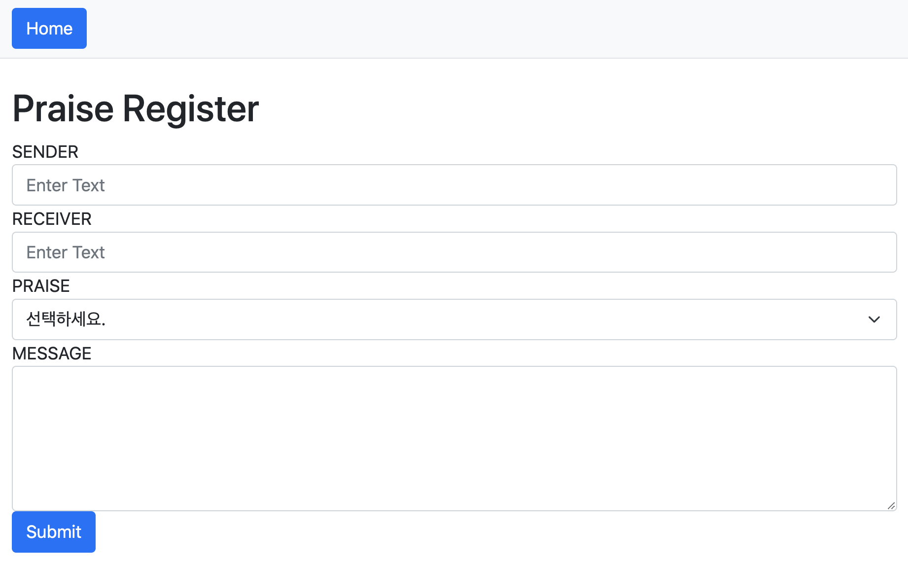
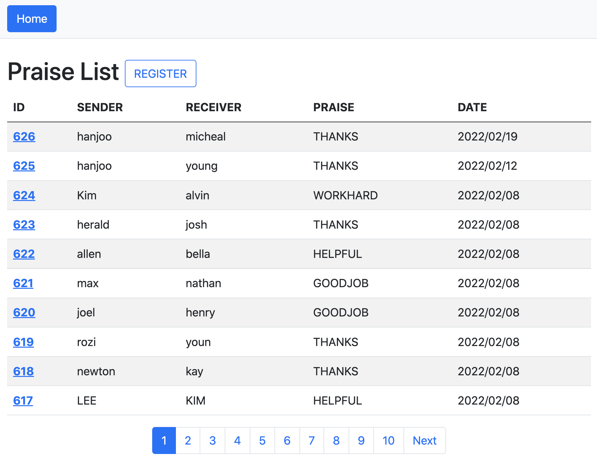
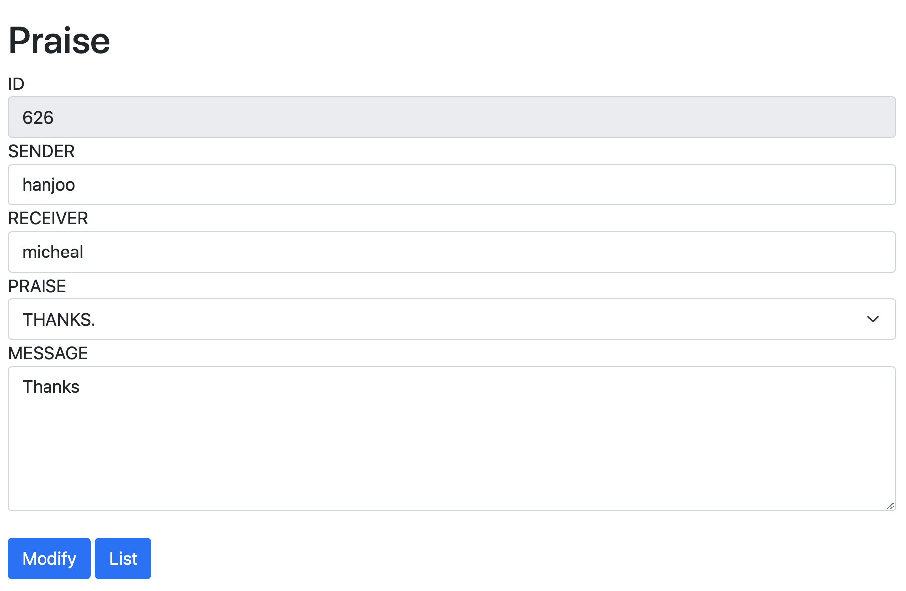

## Prior Knowledge
- Java

## Objectives
- How The Web Work
- Understanding Basic Structure Of Web Application
- Understanding Essential Database
- Developing Simple Web Application

## Lessons Learned
- How The Web Work
    - HTTP
        - The URL gets resolved
        - A Request is sent to the server of the website
        - The response of the server is parsed
        - The page is rendered and displayed
    - Web Client (brower), WAS(Web Application Server), DB

- Basic Structure Of Web Application & Developing Web Application
    - Understanding Basic Structure Of Web Application For HTTP Request

    - Learned Tech Stack 
        - Springboot Based On Java : Web Application OpenSource Framework
        - JPA : Java ORM(Object-Relational Mapping) Framework 
        - Thymeleaf : UI View Template Engine

- Understanding Essential Database
    - MySQL Database Install & Configure Database (Create Database, user) 
    - DDL / DML
        - CREATE TABLE
        - SELECT
        - INSERT
        - UPDATE
        - DELETE
        
---

### Simple Web Application Main Function
- Developing Web Application With Java Springboot
- Implement CRUD(Create,Read,Update,Delete) Function
    - Function1. Praise Register Insert
    
    - Function2. Praise List Select
    
    - Function3. Praise Modify Update
    
    
### Tech Stack
- Development Environment
    - IntelliJ IDEA
    - GIT

- Server Side Tech Stacks
    - Java11
    - Spring Boot
    - JPA

- UI Templete
    - Thymeleaf

- Database
    - MySQL

    
### Springboot Web Application Package Structure
``` bash
hanjoo.kim-cs-project

java
├── controller          -------> # controller to search path
├── domain              -------> # entity model
├── dto                 -------> # manage dto
├── repository          -------> # jpa
└── service             -------> # business logic

resources
├── static              -------> # css / js
└── templates           -------> # Thymeleaf UI View

```
